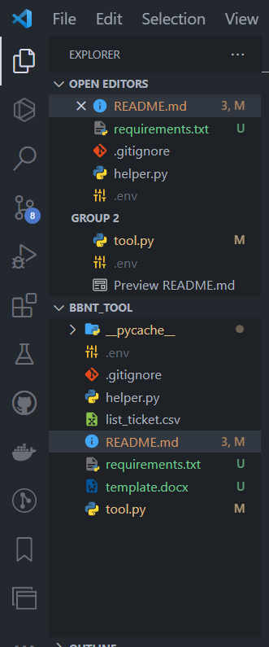
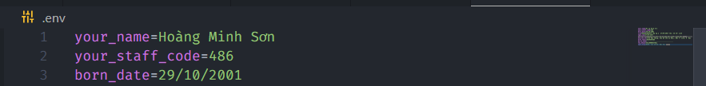
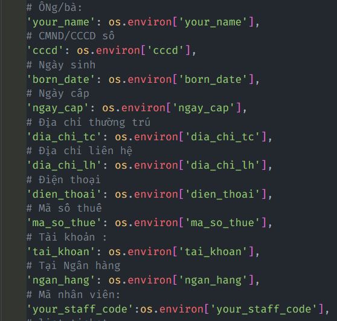
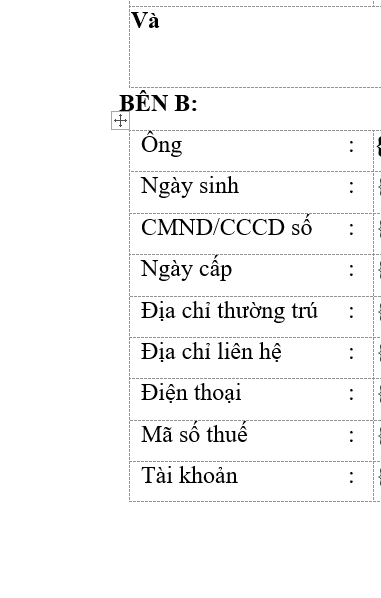
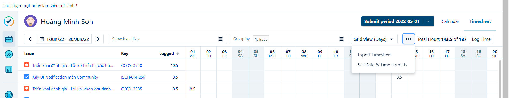
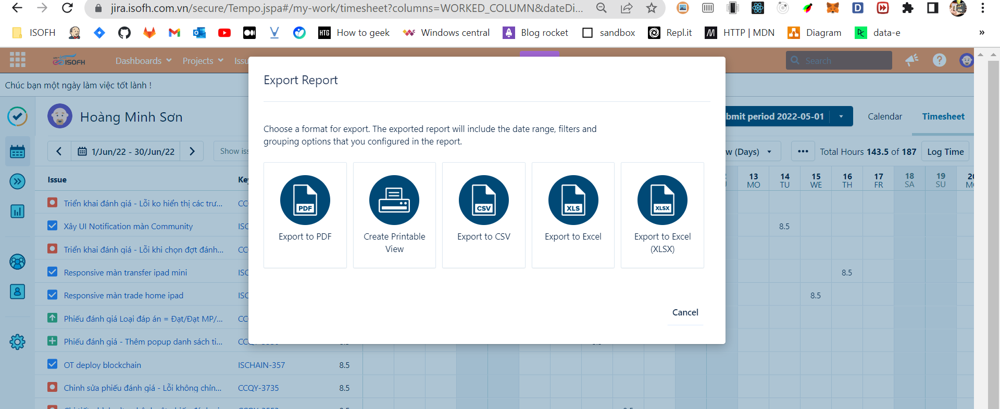
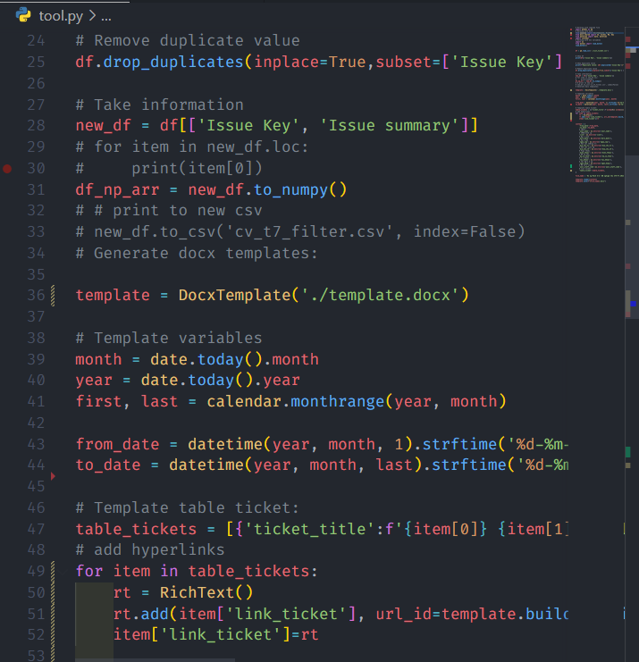
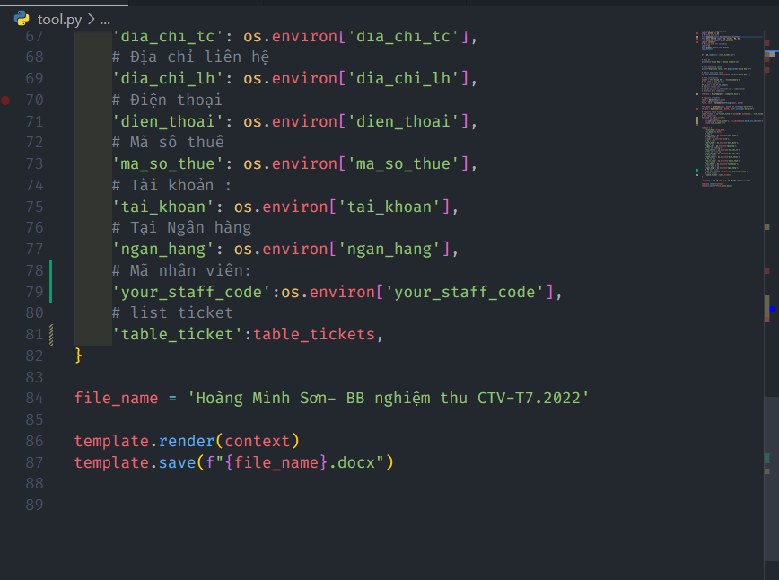

# Hướng dẫn sử dụng tool

## Yêu cầu

- Cài Python 3.9x
- Cài các thư viện
  - pandas
  - python-docx
  - docxtpl
  - python-dotenv

Cú pháp cài:

Đứng tại cùng cấp với thư mục project

```cmd
>pip install -r requirements.txt
```

Hoặc

```cmd
>pip install pandas python-docx docxtpl python-dotenv pandas
```

## Các bước

Project có cấu trúc như sau:

Tạo file .env cấp ngoài cùng :



File có nội dung như sau:

```cmd
your_name=
your_staff_code=
born_date=
cccd=
ngay_cap=
dia_chi_tc=
dia_chi_lh=
dien_thoai=
ma_so_thue=
tai_khoan=
ngan_hang=
```

Nội dung được điền vào sau dấu `=` nguyên dạng cop từ word sang.

Ví dụ:



Trong đó từng biến là :



Ứng với từng trường trong thông tin cá nhân trong file word




**Tải file ticket  của mình trên jira về như sau:**

Vào `Tempo` > `My work` > `...` > `Export timesheet`



Chọn export ra file csv



Lưu file với tên `list_ticket.csv` vào cấp ngoài cùng project Như hình đầu tiên có đề cập cấu trúc thư mục.

**Chú ý** trong file `tool.py`

- Nếu như thực hiện làm bbnt trong đúng tháng thì oke => Ngày tháng trong BBNT đc generate sẽ chuẩn, không phải sửa gì.
- Còn nếu làm trễ sang tháng sau ví dụ BBNT của t7 mà làm trễ sang tầm 1/8 => Sửa 2 biến:

```python
 month = _tháng_làm_bbnt_
 year = năm_làm_bbnt
```




Tên file tự sửa biến `file_name`




## _Good luck!_